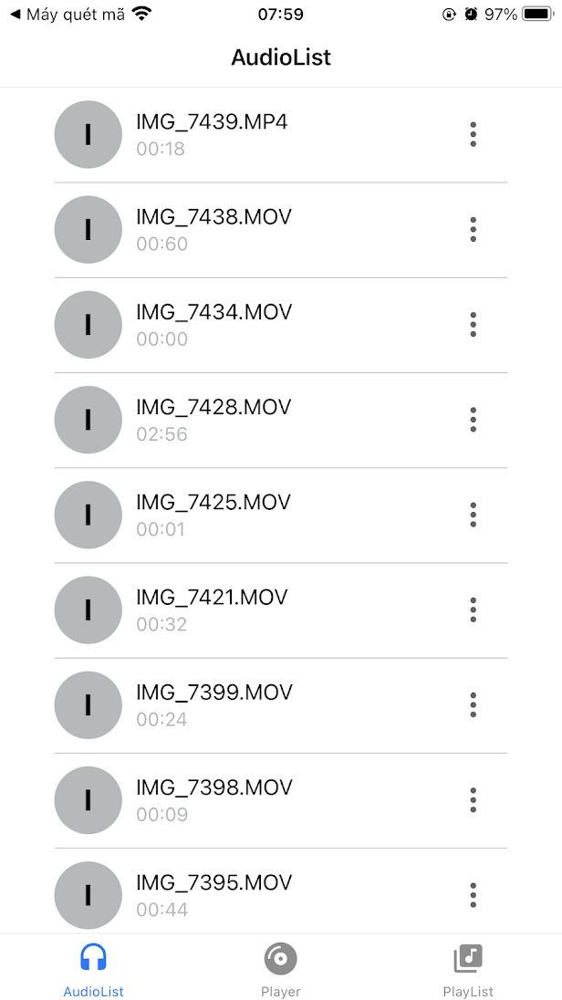
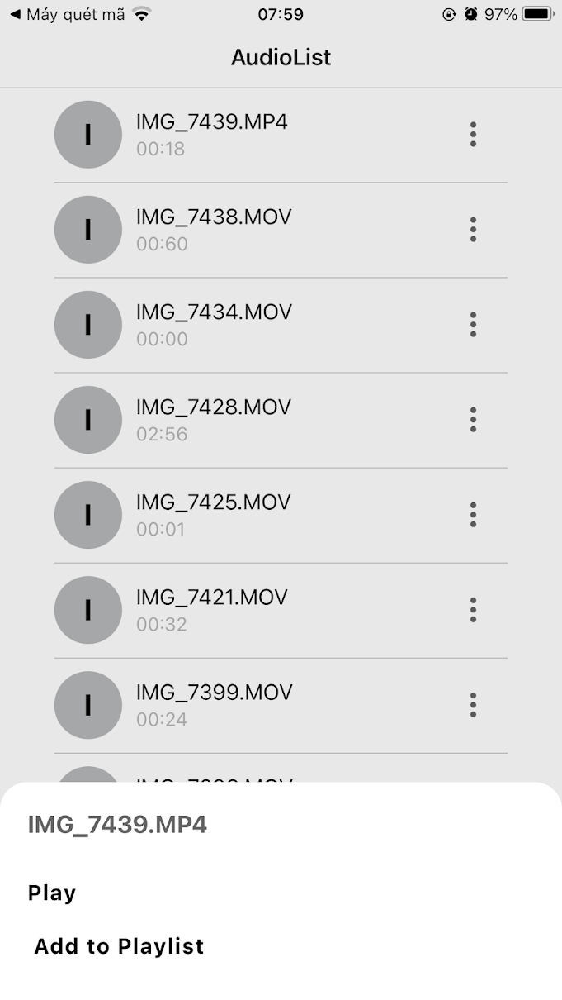

# Project audio player 
> Audio interface and request permission to access the device in use
### Installation && Usage
The application is run online on the website https://snack.expo.dev/ <br>
- Step 1: create an expo account to run the app demo <br>
- Step 2: choose the interface to demo as web, iphone .. or your personal phone
### View code in Screen
- AudioList 
```php
render() {
    return (
      <AudioContext.Consumer>
        {({ dataProvider }) => {
          return (
            <Screen style={styles.container}>
              <RecyclerListView
                dataProvider={dataProvider}
                layoutProvider={this.layoutProvider}
                rowRenderer={this.rowRenderer}
              />
              <OptionModal
              onPlayPress = {() => console.log('Play music')}
              onPlayListPress = {() => console.log('add play list')}

              currentItem = {this.currentItem}
                onClose={() =>
                  this.setState({ ...this.state, optionModalVisible: false })
                }
                visible={this.state.optionModalVisible}
              />
            </Screen>
          );
        }}
      </AudioContext.Consumer>
    );
  }
}
```

- Player
```php
const Player = () => {
  return (
    <View style={styles.container}>
      <Text>  Player </Text>
    </View>
  )

};
```
- Please grant access

```php 
 getAudioFiles = async () => {
    const { dataProvider, audioFiles } = this.state;
    
    let media = await MediaLibrary.getAssetsAsync({
      mediaType: 'video',
    });
    media = await MediaLibrary.getAssetsAsync({
      mediaType: 'video',
      first: media.totalCount,
    });
    this.setState({
      ...this.state,
      dataProvider: dataProvider.cloneWithRows([
        ...audioFiles,
        ...media.assets,
      ]),
      audioFiles: [...audioFiles, ...media.assets],
    });
  };
```
## Result on completion
- Demo 01


- Demo 02



